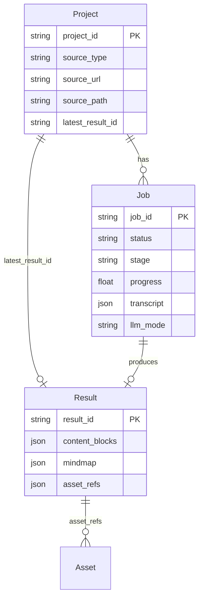

# AGENTS.md — Video Helper 开发上下文

> 面向在 Cursor / 其他 AI 编辑器中进行开发的 LLM Agent。  
> 人类可读介绍见 [`README.zh.md`](README.zh.md)；API 契约见 [`docs/api.md`](docs/api.md)；架构决策见 [`_bmad-output/planning-artifacts/architecture.md`](_bmad-output/planning-artifacts/architecture.md)。

---

## 1. 项目是什么

**Video Helper** 是基于 AI 的**智能视频学习助手**（Monorepo）：

- 输入：视频 URL（B 站 / YouTube / TikTok 等，经 `yt-dlp`）或本地上传（MP4/MKV 等）
- 流水线：下载/落盘 → 语音转写（`faster-whisper`）→ LLM 结构化分析 → 关键帧抽取（FFmpeg）→ 持久化 **Result**
- 输出：**思维导图** + **重点摘要（content blocks）** + **关键帧**，支持导图↔摘要↔视频时间轴联动
- 增值：基于视频上下文的 **AI 问答**、**练习画布（Quiz）**、用户可编辑保存笔记/导图

**两种 LLM 运行模式**（改流水线前务必确认）：

| 模式 | `Job.llm_mode` | 说明 |
|------|----------------|------|
| **backend**（默认） | `backend` 或空 | 后端按设置调用 OpenAI 兼容 API |
| **external** | `external` | 后端只做 ingest/transcribe，Plan 由外部 AI 编辑器（[video-helper-skill](https://github.com/LDJ-creat/video-helper-skill)）提交 |

---

## 2. 技术选型

| 层级 | 路径 | 技术 |
|------|------|------|
| 前端 Web | `apps/web` | Next.js 16（App Router）、React 19、TypeScript、Tailwind CSS v4、`next-intl`（中/英） |
| 状态与请求 | `apps/web/src/lib/api` | TanStack React Query |
| 编辑器 / 可视化 | `apps/web/src/components/features/editor` | Tiptap（笔记）、React Flow + dagre（思维导图） |
| 桌面端 | `apps/desktop` | Electron 33；Sidecar 拉起 `core`（:8000）+ Next standalone（:3000） |
| 后端 API | `services/core` | FastAPI、Python ≥3.12、**uv** 包管理 |
| 数据库 | `DATA_DIR/core.sqlite3` | SQLite + SQLAlchemy 2.x + Alembic |
| 转写 | `core/external/asr_faster_whisper.py` + `core/app/pipeline/asr_router.py` | 云端 ASR（DashScope / OpenAI / Volcengine）优先，失败可降级 faster-whisper |
| 下载 | `core/external/ytdlp.py` | yt-dlp |
| 媒体处理 | `core/external/ffmpeg.py` | FFmpeg（关键帧、音频等） |
| LLM 调用 | `core/app/pipeline/analyze_provider.py` | OpenAI 兼容 `chat/completions` + JSON 输出 |
| 部署 | 根目录 `docker-compose.yml` | GHCR 镜像 `video-helper-core` / `video-helper-web` |

**外部运行时依赖**：FFmpeg、yt-dlp 在 PATH；GPU 可选（CUDA 加速转写）。

---

## 3. 仓库结构

```text
video-helper/
├── apps/
│   ├── web/                    # Next.js 前端（主 UI）
│   │   └── src/
│   │       ├── app/[locale]/     # 路由（next-intl）
│   │       ├── components/       # UI（features/ 按业务域）
│   │       └── lib/              # api、contracts、sse、config
│   └── desktop/                # Electron 打包与 dev 脚本
├── services/
│   └── core/                   # FastAPI + Worker + Pipeline
│       ├── main.py             # uvicorn 入口（加载 .env）
│       ├── src/core/           # 应用源码包 `core`
│       ├── alembic/            # 数据库迁移
│       └── tests/              # pytest（契约 + 流水线单测）
├── docs/
│   └── api.md                  # API 契约（强约束，改接口先读）
├── scripts/                    # smoke、CI 辅助
├── data/                       # 默认 DATA_DIR（本地开发，gitignore）
├── docker-compose.yml
├── Makefile                    # 跨平台常用命令
├── README.zh.md / README.md
└── _bmad-output/               # PRD、架构、实现故事（规划产物，非运行时代码）
```

**不要**把 `_bmad/`、`.claude/commands/` 等 BMAD 脚手架当作产品运行时逻辑。

---

## 4. 核心领域模型



- **Project**：一个「视频笔记」容器；`latest_result_id` 指向当前可渲染版本。
- **Job**：长任务状态机：`queued` → `running` → `succeeded` | `failed` | `canceled`；含 `stage`、`progress`、`transcript`、产物引用。
- **Result**：前端刷新/恢复编辑的**唯一真相**；必须能独立渲染，不依赖 Worker 内存态。
- **Content blocks（vNext）**：章节式内容块 + highlights（含 `startMs`/`endMs`、可选 keyframe）；**导图节点与重点应能追溯到时间或 block**。
- **Asset**：关键帧/视频等；DB 只存 **相对 `DATA_DIR` 的路径**，禁止绝对路径泄露。

ORM 入口：`services/core/src/core/db/models/`（`Project`、`Job`、`Result`、`Asset` 等）。

---

## 5. 分析流水线（最重要）

**编排中心**：`services/core/src/core/app/worker/worker_loop.py`（`WorkerService` 在 `core/main.py` lifespan 中启动）。

> `services/core/src/core/pipeline/runner.py` 目前是占位文件，**不要**假设流水线在那里。

### 5.1 对外稳定阶段（PublicStage）

定义：`services/core/src/core/contracts/stages.py`

| Public stage | 典型内部 stage | 职责 |
|--------------|----------------|------|
| `ingest` | `download`, `upload`, … | yt-dlp 下载或接收上传、元数据 |
| `transcribe` | `speech_to_text` | 云端 ASR 或 faster-whisper 转写，写入 transcript |
| `analyze` | `chunk_summaries`, `plan`, … | LLM 生成 plan（摘要 + 导图结构） |
| `extract_keyframes` | `keyframes`, `keyframe_verify` | FFmpeg 按 plan 时间点抽帧；可选两阶段 LLM verify（低置信度复核 + 重抽后再验证，支持 LLM retry hint） |
| `assemble_result` | — | 写入 `results` 表，更新 `latest_result_id` |

前端阶段映射：`apps/web/src/lib/constants/stageMapping.ts`。

进度与可观测性：

- **SSE**：`GET /api/v1/jobs/{jobId}/events`（`heartbeat` | `progress` | `log` | `state`）
- **日志**：`GET /api/v1/jobs/{jobId}/logs`
- 事件总线：`core/app/sse/event_bus.py`

### 5.2 短视频路径（标准）

1. Ingest → 音频/视频落盘  
2. Transcribe → `transcribe_real.py` 经 `asr_router.py` 调用云端或本地 ASR，写入 `transcript.json`（带时间戳片段）  
3. **Plan**（`core/app/pipeline/llm_plan.py`）  
   - 调用 `AnalyzeProvider.generate_json`  
   - Pydantic 校验 `PlanOutput`（`contentBlocks` + `mindmap`）  
   - 失败时 `llm_json_repair.py` 尝试修复 JSON  
4. Keyframes → `keyframes.py` / `keyframe_verify.py`  
5. `assemble_result()` → `core/pipeline/stages/assemble_result.py`

Plan 产物会缓存到 `DATA_DIR/{projectId}/artifacts/plan/{jobId}/`，便于失败后重试、调试。

### 5.3 长视频路径（Map-Reduce）

触发：`chunk_summaries.should_use_long_video_path()`（时长/配置阈值）。

1. **Map**：`chunk_summaries.py` 将 transcript 分块，**并发**调用 LLM 生成 chunk summaries  
2. **Reduce**：`llm_plan.generate_plan()` 消费 summaries 生成最终 plan  
3. 后续与短视频相同（keyframes → assemble）

相关测试：`tests/test_long_video_chunk_summaries.py`、`tests/test_llm_plan_generate.py`。

### 5.4 LLM 子系统

| 模块 | 路径 | 作用 |
|------|------|------|
| Provider 抽象 | `app/pipeline/analyze_provider.py` | HTTP 调用、密钥、重试、错误映射 |
| Plan 生成 | `app/pipeline/llm_plan.py` | Prompt、schema、分步 generate（blocks/mindmap） |
| JSON 修复 | `app/pipeline/llm_json_repair.py` | 校验失败后的 repair 回合 |
| 设置与密钥 | `app/api/settings.py` + `db/repositories/llm_settings.py` | 多 Provider、加密存密钥（`llm/secrets_crypto.py`） |
| 目录 | `llm/catalog.py` | 内置 + 自定义 provider/model |
| 在线特性 | `app/api/ai.py` + `llm/interaction.py` | Chat、Quiz（不走 Job 队列） |

环境变量兜底（优先级低于 DB 设置）：`LLM_API_BASE`、`LLM_API_KEY`、`LLM_MODEL`（见 `services/core/.env.example`）。

### 5.5 云端 ASR 子系统

Settings 页（`/settings`）或 API 配置云端语音识别；启用后转写阶段**优先云端**，失败且 `fallbackToLocal=true` 时自动降级本地 faster-whisper。

| 模块 | 路径 | 作用 |
|------|------|------|
| 路由与 fallback | `app/pipeline/asr_router.py` | 云端/本地选择、错误映射、计时 |
| 转写入口 | `app/pipeline/transcribe_real.py` | Worker 调用的转写实现 |
| Provider 适配 | `external/asr_providers/` | DashScope、OpenAI Whisper、火山引擎 |
| 设置解析 | `asr/runtime.py` | DB active + 加密密钥 + 环境变量兜底 |
| 设置 API | `app/api/settings.py` | catalog / active / secret / test |
| 本地降级参数 | 环境变量 | `TRANSCRIBE_MODEL_SIZE`、`TRANSCRIBE_DEVICE`（不由前端配置） |

首期后端支持 provider：`dashscope`、`openai`、`volcengine`。环境变量兜底：`DASHSCOPE_API_KEY`、`OPENAI_API_KEY`、`VOLCENGINE_ASR_API_KEY`、`ASR_CLOUD_ENABLED` 等（见 `.env.example`）。契约见 `docs/api.md` ASR 章节；测试见 `tests/test_asr_settings_and_router.py`。

Job 日志含 `asr_fallback` 时，前端 `AnalysisProgressPanel` 会提示已降级本地转写。

### 5.6 External 模式（AI 编辑器 Skill）

Job 创建时可设 `llmMode: "external"`。Worker 在 transcribe 后等待外部提交：

- `GET/POST .../jobs/{id}/chunk-summaries`（长视频）  
- `GET/POST .../jobs/{id}/plan`  

详见 `docs/api.md` 与 `tests/test_external_plan_flow.py`。

---

## 6. 后端模块地图

```text
services/core/src/core/
├── main.py                 # FastAPI app、路由挂载、Worker 生命周期
├── settings.py             # 部分全局配置
├── app/
│   ├── api/                # REST 路由（按资源分文件）
│   │   ├── jobs.py         # 创建/查询/取消/重试/resume/external 提交
│   │   ├── projects.py
│   │   ├── results.py
│   │   ├── assets.py       # 安全读文件（防目录穿越）
│   │   ├── editing.py      # 保存 content_blocks / mindmap / highlight keyframe
│   │   ├── settings.py     # LLM、yt-dlp cookies、ASR prefetch
│   │   ├── search.py
│   │   ├── ai.py           # chat、quiz
│   │   └── health.py
│   ├── worker/worker_loop.py   # ★ 流水线主编排
│   ├── pipeline/           # ingest 后各阶段实现（含 asr_router.py）
│   ├── sse/                # Job SSE
│   ├── logs/               # job_logs、pipeline_timings
│   └── smoke/              # 闭环 smoke 校验
├── asr/                    # 云端 ASR catalog、runtime、连通性测试
├── contracts/              # stages、error_codes、SSE、progress（前后端契约）
├── db/
│   ├── models/
│   ├── repositories/       # jobs、projects、results、llm_settings、asr_settings...
│   └── session.py          # DATA_DIR、SQLite engine
├── external/               # ffmpeg、ytdlp、asr_faster_whisper、asr_providers/
├── llm/                    # catalog、interaction、secrets
├── schemas/                # Pydantic DTO（API 响应/请求）
└── storage/                # layout、safe_paths
```

**并发**：`MAX_CONCURRENT_JOBS`（默认 2）；队列认领 `db/repositories/job_queue.py`。

---

## 7. 前端模块地图

### 7.1 主要路由（`apps/web/src/app/[locale]/(main)/`）

| 路径 | 页面 | 说明 |
|------|------|------|
| `/` | 首页 | 入口 |
| `/ingest` | 创建分析 | URL / 上传 → `POST /jobs` |
| `/jobs` | 任务列表 | |
| `/jobs/[jobId]` | 任务进度 | SSE + 轮询降级 |
| `/projects` | 项目列表 | |
| `/projects/[projectId]/results` | **结果页** | 导图、笔记、播放器、AI、Quiz |
| `/search` | 搜索 | |
| `/settings` | 设置 | LLM、cookies 等 |

Locale：`zh` / `en`（`src/messages/*.json`）。

### 7.2 API 客户端约定

- 端点常量：`src/lib/api/endpoints.ts`（与 `docs/api.md` 对齐）
- 类型契约：`src/lib/contracts/*`（与后端 `core/contracts`、`core/schemas` 对应）
- Base URL：`src/lib/config.ts`  
  - 浏览器：默认同源，靠 `next.config.ts` **rewrites** 代理到 backend  
  - Electron：`http://127.0.0.1:8000`  
  - Docker：`API_BASE_URL=http://core:8000`

### 7.3 结果页核心组件

| 组件 | 文件 | 职责 |
|------|------|------|
| `ResultLayout` | `components/layout/ResultLayout.tsx` | 三栏布局 |
| `MindmapEditor` / `MindmapViewer` | `features/editor/` | React Flow 导图 |
| `NoteEditor` | `NoteEditor.tsx` | Tiptap 富文本 |
| `HighlightList` | `HighlightList.tsx` | 重点列表 ↔ 时间轴 |
| `VideoPlayer` / `FloatingPlayer` | `features/player/` | 跳转 `startMs` |
| `AIChat` | `AIChat.tsx` | 多轮问答 |
| `ExercisesCanvas` | `ExercisesCanvas.tsx` | Quiz |

联动逻辑：导图节点 / highlight 的 `startMs`（及 `chapter_id` / `blockId` 等字段，以 Result JSON 为准）驱动播放器 `seek`。

### 7.4 Next.js 代理路由

部分 AI 请求走 App Router BFF：`apps/web/src/app/api/v1/*`（如 chat、quiz、sse 转发），避免 CORS 或统一鉴权。

---

## 8. 数据目录布局（DATA_DIR）

默认：仓库根目录 `data/`（可通过 `DATA_DIR` 环境变量覆盖）。

```text
data/
├── core.sqlite3
├── cookies/ytdlp_cookies.txt      # 可选，启动时自动加载到环境变量
└── {projectId}/
    ├── uploads/{jobId}/           # 上传原文件
    └── artifacts/
        ├── plan/{jobId}/          # plan、LLM 请求链、analysis_chain.json
        ├── transcript/            # transcript.json 等
        └── ...                    # 关键帧图片等（经 Asset 引用）
```

**安全**：任何读文件必须经 `storage/safe_paths.py` 或 assets API，禁止拼接用户输入路径。

---

## 9. API 与契约（改代码前必读）

- **权威文档**：[`docs/api.md`](docs/api.md)  
- **Base path**：`/api/v1`  
- **错误格式**：统一 `error envelope`（`code` + `message` + `details` + `requestId`）— `core/contracts/error_codes.py`  
- **时间**：Unix **毫秒**（number）  
- **ID**：UUID 字符串  
- **列表分页**：cursor 风格 `{ items, nextCursor }`  

契约测试示例：`tests/test_contract_api_md.py`、`tests/test_contract_stage.py`。

---

## 10. 本地开发速查

### 10.1 环境

| 要求 | 版本/说明 |
|------|-----------|
| Node.js | ≥ 20 |
| pnpm | 前端包管理（`apps/web`） |
| Python | ≥ 3.12 |
| uv | `pip install uv` |
| FFmpeg | PATH |
| 可选 GPU | 转写 CUDA |

### 10.2 启动

```bash
# 后端
cd services/core
cp .env.example .env    # Windows: Copy-Item .env.example .env
# 确保 WORKER_ENABLE=1
uv run python main.py     # :8000

# 前端
cd apps/web
pnpm install
cp .env.example .env.local
pnpm run dev              # :3000

# 桌面一体化开发（仓库根目录）
node apps/desktop/scripts/dev.js
```

### 10.3 Makefile（推荐）

```bash
make help
make web-dev
make core-dev          # 若 Makefile 中已定义
make core-test         # uv run pytest -q
make core-smoke        # 闭环 smoke（需已启动 core）
make desktop-dev
```

### 10.4 测试

```bash
cd services/core
uv run pytest -q
uv run pytest tests/test_llm_plan_generate.py -q   # 单文件
```

改 **契约 / 阶段名 / 错误码** 时，务必跑 `test_contract_*` 与相关 API 测试。

### 10.5 数据库迁移

```bash
cd services/core
uv run alembic upgrade head
# 改 models 后: alembic revision --autogenerate -m "..." && 人工 review
```

---

## 11. 开发约定（减少返工）

1. **最小改动**：只改与任务相关的模块；匹配现有命名与分层。  
2. **契约优先**：改 API 先更新 `docs/api.md` + 前端 `lib/contracts` + pytest 契约测试。  
3. **Stage 名稳定**：`PublicStage` 与 SSE `stage` 字段不得随意重命名（见 `contracts/stages.py`）。  
4. **路径**：DB 与 API 只暴露 `DATA_DIR` 相对路径；日志不得打印 API Key。  
5. **Result 可恢复**：新字段加入 `Result` 时，确保 `GET .../results/latest` 足够前端渲染。  
6. **长视频**：动 `llm_plan` / `chunk_summaries` 时同时考虑 Map 与 Reduce 两侧及缓存 artifacts。  
7. **前端请求**：优先用 React Query + 已有 `queryKeys`；Job 进度优先 SSE（`useJobSse`），失败再轮询。  
8. **CodeGraph**：本仓库已配置 CodeGraph MCP（`.cursor/rules/codegraph.mdc`）。查符号定义、调用链、影响面时用 `codegraph_context` / `codegraph_search`，避免盲目全库 grep。  

---

## 12. 常见任务 → 入口文件

| 任务 | 先看 |
|------|------|
| 新增/修改流水线阶段 | `app/worker/worker_loop.py` → 对应 `app/pipeline/*.py` |
| 调整 LLM Prompt / Plan schema | `app/pipeline/llm_plan.py` |
| 长视频分块策略 | `app/pipeline/chunk_summaries.py` |
| 转写质量/性能 / 云端 ASR | `app/pipeline/asr_router.py`、`external/asr_providers/`、Settings 页 ASR 区块；本地参数见 `.env` 中 `TRANSCRIBE_*` |
| 下载失败 / 平台兼容 | `external/ytdlp.py`、`jobs.py` ingest |
| 关键帧抽取 | `app/pipeline/keyframes.py`、`keyframe_verify.py` |
| 新 REST 接口 | `app/api/*.py` + `schemas/` + `docs/api.md` |
| 结果页 UI / 联动 | `projects/[projectId]/results/page.tsx` + `features/editor/*` |
| LLM 设置 UI | `components/features/settings/SettingsForm.tsx` + `settings.py` |
| ASR / 云端转写设置 | `components/features/settings/AsrSettingsSection.tsx` + `settings.py` ASR API |
| Electron 打包 | `apps/desktop/PACKAGING.md`、`scripts/build-all.ps1` |

---

## 13. 参考文档索引

| 文档 | 用途 |
|------|------|
| [`README.zh.md`](README.zh.md) | 产品说明、快速开始 |
| [`docs/api.md`](docs/api.md) | API 契约 |
| [`_bmad-output/planning-artifacts/architecture.md`](_bmad-output/planning-artifacts/architecture.md) | 架构决策（SQLite、SSE、编辑模型等） |
| [`_bmad-output/planning-artifacts/prd.md`](_bmad-output/planning-artifacts/prd.md) | 产品需求 |
| [`apps/desktop/PACKAGING.md`](apps/desktop/PACKAGING.md) | 桌面打包 |
| [`services/core/.env.example`](services/core/.env.example) | 后端环境变量说明 |

架构示意图（README 引用）：`docs/assets/overview.png`、`docs/assets/core-flow.png`。

---

## 14. 当前演进方向（供 Agent 对齐）

仓库近期改动集中在 **LLM 流水线优化**（见 git 状态中 `services/core` 下 `llm_plan`、`chunk_summaries`、`analyze_provider`、`keyframe_verify`、`interaction` 等）。开发时：

- 保持 **PlanOutput / content_blocks** 与前端 `resultTypes` 一致  
- 长视频与短视频分支行为都需在 pytest 中覆盖  
- 不要恢复已移除的 legacy pipeline（`test_remove_legacy_pipeline.py` 有约束）  

---

*本文档随代码演进需人工更新；若与 `docs/api.md` 冲突，以 `docs/api.md` 和 pytest 契约为准。*
