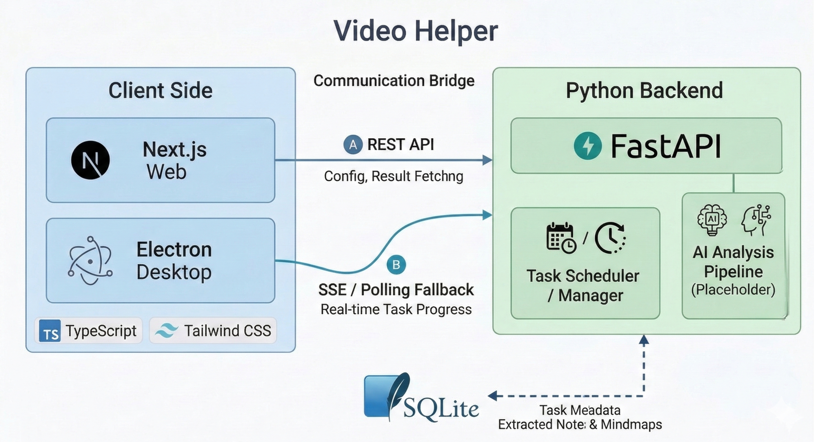
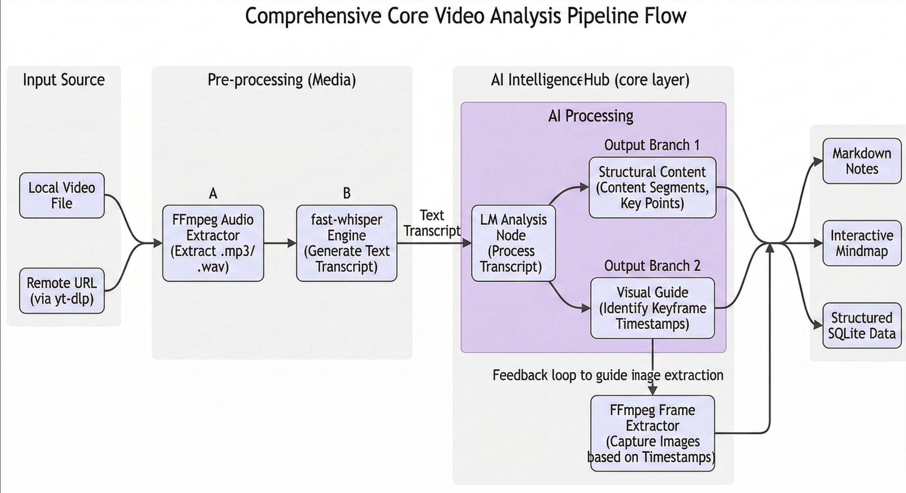

<h1 align="center">Video Helper</h1>

<p align="center">
  <strong>AI-powered Video Analysis Assistant for efficient learning and knowledge retrieval</strong>
</p>

<p align="center">
  English | <a href="README.zh.md">中文</a>
</p>

<p align="center">
  <a href="#features">Features</a> •
  <a href="#architecture">Architecture</a> •
  <a href="#getting-started">Getting Started</a> •
  <a href="#contribution">Contribution</a>
</p>

<p align="center">
  If you like this project, please give it a Star ⭐!
</p>

---

## 📖 Introduction

**Video Helper** is an AI-powered **Video Learning Assistant** and **Study Tool** designed to significantly improve the efficiency of **video analysis**, knowledge retrieval, and note-taking.

This project adopts a full-stack Monorepo architecture and integrates advanced **LLM analysis pipelines**. Users simply provide a video link (e.g., Bilibili, YouTube, TikTok) or upload a local video, and the system automatically extracts core content, generating structured **Mind Maps** and **Key Summaries**.

The core highlight lies in its outstanding **interactive linkage**: clicking on a mind map node precisely navigates to the corresponding key content module, and clicking on a content module can jump to the corresponding video segment. Additionally, the built-in AI assistant supports multi-turn Q&A and can generate practice questions based on video knowledge points to form a complete learning loop.

### 🎥 Demo Video

<div align="center">
  <video src="docs/assets/video-en.mp4" width="100%" controls autoplay muted loop></video>
</div>

## <a id="features"></a>✨ Key Features

- **Smart Pipeline Analysis**: Automated handling of video downloading, audio transcription, content extraction, and structured analysis. It supports LLM-guided keyframe extraction via FFmpeg to provide visual context alongside key summaries.
- **Dynamic Mind Map**: Generates visual knowledge structure maps supporting zooming, dragging, and adding/deleting/editing nodes.
- **Bi-directional Interaction**:
    - **Mind Map -> Content**: Click a map node to automatically locate the corresponding key content module.
    - **Content -> Video**: Click summary highlights to jump the video stream to the corresponding timestamp.
- **AI Q&A**: Supports multi-turn dialogue with the user based on video context, explaining difficult points in depth.
- **Quiz Canvas**: AI automatically generates questions based on video knowledge points, providing targeted practice and feedback.
- **Flexible Editing**: Supports manual adjustment of mind map logic and summary content to customize personalized learning notes.

### 🚀 Why Video Helper?

| Features | Traditional Learning | Video Helper |
| :--- | :--- | :--- |
| **Structuring** | Manual notes, time-consuming | **Auto-generated Mind Maps & Key Notes** |
| **Navigation** | Constant scrubbing | **One-click Precise Jump** |
| **Consolidation** | Weak feedback loop | **AI-Generated Quizzes** |
| **Understanding** | No immediate help | **24/7 AI Q&A Assistant** |


## <a id="architecture"></a>🏗️ Architecture

This project uses Monorepo architecture to manage frontend and backend, ensuring efficient code maintenance and scalability.

- **Frontend**: `apps/web`
    - **Framework**: [Next.js 16](https://nextjs.org/) (App Router)
    - **Language**: TypeScript, React 19
    - **Styling**: Tailwind CSS v4
    - **Visualization**: ReactFlow (Mind Map), Tiptap (Rich Text Notes)
- **Backend**: `services/core`
    - **Framework**: [FastAPI](https://fastapi.tiangolo.com/)
    - **Language**: Python 3.12+
    - **Database**: SQLite + SQLAlchemy (ORM) + Alembic (Migrations)
    - **Package Management**: [uv](https://github.com/astral-sh/uv)
    - **AI Pipeline**: Integrates whisper (transcription), LLM (analysis/summarization)

### Architecture diagrams



*Figure: System architecture overview.*



*Figure: Core video analysis flow.*

## <a id="getting-started"></a>🚀 Getting Started

Choose **one of three options** based on your use case:

---

### 🖥️ Option 1: Download the Client

No environment setup required. Download the pre-built installer for your platform and run it directly:

| Windows | MacOS | Linux |
| :---: | :---: | :---: |
|  |  |  |
| [Setup.exe](https://github.com/LDJ-creat/video-helper/releases/latest) | [dmg/zip](https://github.com/LDJ-creat/video-helper/releases/latest) | [AppImage](https://github.com/LDJ-creat/video-helper/releases/latest) |

---

### 🐳 Option 2: Deploy with Docker

Ideal for deploying on a server or anyone who wants a running instance without a local dev environment.

**1. Clone the repository**

```bash
git clone https://github.com/LDJ-creat/video-helper.git
cd video-helper
```

**2. Start services**

```bash
docker compose up -d
```

**3. Open**

- Web UI: http://localhost:3000
- Backend API: http://localhost:8000

> Data is persisted to the `./data` folder in the project root.

**Port conflicts (if `8000` or `3000` is already in use)**

To resolve port conflicts, switch to different ports:

```bash
# Linux / macOS
CORE_HOST_PORT=8001 WEB_HOST_PORT=3001 docker compose up -d
```

```powershell
# Windows (PowerShell)
$env:CORE_HOST_PORT="8001"; $env:WEB_HOST_PORT="3001"; docker compose up -d
```

---

### 🛠️ Option 3: Build from Source (For developers)

For contributors, developers who want to modify the code, or those running the full stack locally.

**Prerequisites**

- **Node.js** >= 20.x
- **Python** >= 3.12
- **uv** (Python package manager, install: `pip install uv`)
- **FFmpeg** (must be in system PATH)

#### 1. Clone the repository

```bash
git clone https://github.com/LDJ-creat/video-helper.git
cd video-helper
```

#### 2. Start the backend

```bash
cd services/core

# Create config file from template
cp .env.example .env          # Linux/macOS
Copy-Item .env.example .env   # Windows (PowerShell)

# First run automatically creates a virtualenv and installs deps
# Start API service (port 8000)
uv run python main.py
```

Common command: `uv run pytest -q` (run tests)

#### 3. Start the frontend

```bash
cd apps/web
pnpm install

cp .env.example .env.local          # Linux/macOS
Copy-Item .env.example .env.local   # Windows (PowerShell)

pnpm run dev
```

Open your browser at [http://localhost:3000](http://localhost:3000).

#### 4. Desktop App (Electron) Startup & Build

**Development mode** (run from project root — auto-launches backend, frontend, and Electron):

```bash
node apps/desktop/scripts/dev.js
```

**Local packaging test:**

```bash
cd apps/desktop
pnpm run pack
```

**Build full release installer (Windows only):**

```powershell
# Run from project root in PowerShell
powershell -ExecutionPolicy Bypass -File apps\desktop\scripts\build-all.ps1
```

> To build Docker images locally (developer override):
> ```bash
> docker compose -f docker-compose.yml -f docker-compose.dev.yml up -d --build
> ```

## ⚡Using as an AI Skill

You can also use the backend service of this project as a skill within AI editors like **Claude Code**, **Antigravity**, or **GitHub Copilot**. In this mode, you don't need to configure LLMs in the backend project itself; instead, the AI editor's LLM handles the analysis.

To use it:
1. Download the source code and start the backend service.
2. Download and install the dedicated skill from: [video-helper-skill](https://github.com/LDJ-creat/video-helper-skill).
3. Follow the usage guide in the skill repository to perform video analysis using your AI editor, and view the structured results in the web or desktop app.


## 📂 Directory Structure

```graphql
video-helper/
├── apps/
│   ├── web/                # Next.js Frontend App
│   └── desktop/            # Electron Desktop App
├── services/
│   └── core/               # Python FastAPI Backend
├── docs/                   # Documentation
├── scripts/                # Automation Scripts (e.g., Smoke Tests)
├── _bmad-output/           # Architecture & Planning Artifacts
├── docker-compose.yml      # (Optional) Docker setup
└── README.md               # Project Documentation
```

## License

This project is licensed under the MIT License – see the [LICENSE](LICENSE) file for details.

## <a id="contribution"></a>🤝 Contribution

Issues and Pull Requests are welcome! Before submitting code, please ensure it passes the project's Smoke Tests and adheres to code standards.

## ❓ FAQ

**Q: Which platforms are supported?**
A: Powered by `yt-dlp`, we support Bilibili, YouTube, and many other platforms. You can also upload local MP4/MKV videos.

**Q: Do I need to pay for the LLM?**
A: You can integrate your own API keys (OpenAI, Claude, etc.). If using as an AI Skill, you can use the model provided by your AI editor.

**Q: How does it handle long videos? Is it slow?**
A: For long videos, we use a MapReduce strategy: the video content is split and analyzed concurrently by multiple LLM calls, then aligned and aggregated by a master LLM. A 1-hour video typically takes 15-20 minutes to process.


---
*Created with ❤️ by the Open Source Community*
