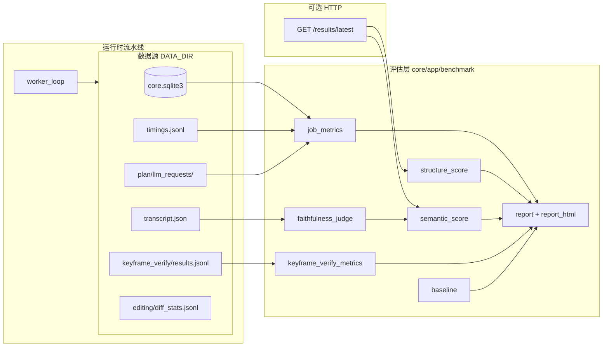

# 评估体系架构设计与实现

> **背景**：Video Helper 是单机部署的 AI 视频学习助手，流水线产出 Result（导图 + 摘要 + 关键帧）。为在**不引入 Prometheus 等外部监控**的前提下量化「跑得怎样、产得好不好」，在 monorepo 内搭建了 L0–L3 四层评估体系。
> **文档用途**：说明体系如何分层、数据从哪来、模块如何协作、报告如何组装；供后续扩展指标或新增 profile 时对齐设计。
> **操作手册**：日常命令与阈值见 [`docs/evaluation.md`](../evaluation.md)、[`benchmarks/README.md`](../../benchmarks/README.md)。

---

## 1. 设计目标

| 目标 | 做法 |
|------|------|
| **零额外基础设施** | 复用 `DATA_DIR`（SQLite + artifacts），不依赖 CI 定时任务或独立 metrics 服务 |
| **分层可组合** | L0 契约 → L1 性能 → L2 结构规则 → L3 语义/人工；高层可选，默认路径轻量 |
| **主动 + 被动** | `mode=benchmark` 创建 Job 闭环；`mode=report` 对历史 Job 离线打分 |
| **机器可读 + 人可读** | JSON 为真相源；同步生成 MD 摘要与自包含 HTML 可视化 |
| **可选能力不阻塞主路径** | LLM judge、keyframe verify、人工 rubric 默认关闭或缺数据时 `enabled:false`，不参与 `passed` |

---

## 2. 分层模型（L0–L3）

```text
┌─────────────────────────────────────────────────────────────────┐
│ L3 语义质量（可选）                                              │
│  · Golden 章节边界 F1                                            │
│  · LLM highlight 忠实度 judge                                    │
│  · 人工 rubric（chapterQuality / faithfulness / mindmapUsability）│
│  · Keyframe verify 专项（P50 confidence、keepRate 等）           │
├─────────────────────────────────────────────────────────────────┤
│ L2 结构质量（规则，必跑）                                        │
│  · Result DTO 硬校验 + 7 项软检查加权分                          │
├─────────────────────────────────────────────────────────────────┤
│ L1 性能（必跑）                                                  │
│  · E2E / 执行耗时 / speedFactor / 分阶段 timings / LLM 调用统计   │
├─────────────────────────────────────────────────────────────────┤
│ L0 契约（pytest，独立入口）                                      │
│  · API 契约、阶段名、smoke closed-loop                           │
└─────────────────────────────────────────────────────────────────┘
```

### 2.1 L0 — 契约与回归测试

- **测什么**：前后端契约、流水线阶段枚举、smoke 闭环能否产出合法 Result。
- **入口**：`make core-test`；smoke 脚本 `services/core/scripts/smoke_closed_loop.py`。
- **与 benchmark 关系**：L2 结构分复用 `validate_result_dto`（`core/app/smoke/closed_loop.py`）作为硬门禁；DTO 不合法则 `structureScore.score = 0`。

### 2.2 L1 — 性能与可观测性

- **测什么**：
  - **队列与端到端**：`queueWaitMs`、`executionMs`、`e2eMs`（来自 `jobs` 表时间戳字段）
  - **速度因子**：`speedFactor = executionMs / videoDurationMs`
  - **分阶段耗时**：解析 `artifacts/{jobId}/timings.jsonl`，按 `step` 聚合
  - **LLM 开销**：统计 `artifacts/plan/{jobId}/llm_requests/*.json` 调用数、repair、重试；可选读 `analysis_chain.json`
- **实现**：`core/app/benchmark/job_metrics.py` → `collect_job_metrics()`
- **批量扫描**：`scripts/collect_job_metrics.py`、`collect_all_job_metrics.py`（`make core-metrics`）

### 2.3 L2 — Result 结构质量（规则）

- **测什么**：在不调用 LLM 的前提下，用确定性规则评价 Result JSON 的完整性与可用性。
- **双轨输出**：
  - **`score`**：7 项软检查加权（权重和 1.0），`min(1, value/threshold) × weight`
  - **`passed`**：未 skip 的项须全部 `ok=true`（AND 门禁）
- **七项指标**（`structure_score.py`）：

| 检查项 | 含义 | 默认阈值 | 权重 |
|--------|------|----------|------|
| `blocks_count` | 章节块数量 | ≥2 | 0.10 |
| `highlights_count` | 全部 highlight 数 | ≥5 | 0.10 |
| `mindmap_nodes` | 导图节点数 | ≥3 | 0.10 |
| `keyframe_coverage` | highlight 带 `keyframe` 的比例 | ≥0.5 | 0.20 |
| `timestamp_in_range` | 时间戳在 `[0, durationMs]` 内 | 100% | 0.20 |
| `timestamp_monotonic` | block `startMs` 非递减 | 100% | 0.15 |
| `mindmap_link_rate` | 非 root 节点含 `targetBlockId` | ≥80% | 0.15 |

- **条件跳过**：`keyframe_coverage` 在流水线未进入关键帧路径，或 `keyframes.extract` 空跑（&lt;500ms 且无产出）时标记 `skipped`，权重重归一化，不参与 `passed`。
- **独立 CLI**：`scripts/score_result_structure.py`（单测结构分，不拉完整报告）。

### 2.4 L3 — 语义与主观质量（可选组合）

L3 不是单一分数，而是**可插拔子模块**的集合：

| 子模块 | 输入 | 输出字段 | 默认 |
|--------|------|----------|------|
| **章节边界 F1** | `golden/{profile}/expected_chapters.json` + Result blocks | `semanticScore.chapterBoundaries` | `--with-semantic` |
| **LLM 忠实度 judge** | highlight + transcript 证据窗 | `semanticScore.highlightFaithfulness` | 关；`--with-llm-judge` |
| **人工 rubric** | CLI 打分 → `golden/{profile}/scores/*.json` | `humanRubric` | `--merge-rubric` |
| **Keyframe verify** | `keyframe_verify/results.jsonl` | `keyframeVerify` | verify 关 → `enabled:false` |

**编辑信号（预留）**：用户保存笔记/导图时，`editing_diff.py` 向 `artifacts/editing/diff_stats.jsonl` 追加变更统计，供未来 L3 分析「人工修正幅度」。

---

## 3. 系统架构

### 3.1 组件与数据流



### 3.2 编排入口

**主入口**：`services/core/scripts/run_benchmark.py`

1. **`mode=benchmark`**：读 `benchmarks/profiles.yaml` → 创建 Job（上传或 URL）→ 等待完成 → 组装报告
2. **`mode=report`**：给定 `job_id` / `project_id`，纯离线聚合，不重跑流水线

**闭环脚本**（Makefile 封装）：

- `scripts/benchmark-closed-loop.sh` / `.ps1` → `make core-benchmark`
- `apply_profile_env.py`：将 profile 内 `keyframeVerify.mode` 等注入环境变量

**报告渲染**：`render_benchmark_html.py` 可从已有 JSON 单独生成 HTML。

### 3.3 模块职责

| 模块 | 路径 | 职责 |
|------|------|------|
| `job_metrics` | `benchmark/job_metrics.py` | L1 聚合 |
| `structure_score` | `benchmark/structure_score.py` | L2 规则打分 |
| `semantic_score` | `benchmark/semantic_score.py` | L3 章节 F1 + 合并 faithfulness |
| `faithfulness_judge` | `benchmark/faithfulness_judge.py` | LLM 评判 highlight vs transcript |
| `keyframe_verify_metrics` | `benchmark/keyframe_verify_metrics.py` | 读 verify artifact 聚合率值 |
| `human_rubric` | `benchmark/human_rubric.py` | 加载/校验 rubric JSON |
| `baseline` | `benchmark/baseline.py` | 与 `baseline.json` 及 profile 阈值对比 |
| `environment` | `benchmark/environment.py` | Git SHA、模型、GPU 等快照 |
| `profiles` | `benchmark/profiles.py` | 解析 `profiles.yaml` |
| `http_client` | `benchmark/http_client.py` | 创建 Job、轮询、`get_latest_result` |
| `report` | `benchmark/report.py` | 组装 schema、`passSummary`、写 JSON/MD |
| `report_html` | `benchmark/report_html.py` | 自包含 HTML（瀑布图、检查卡片、L3 区块） |
| `editing_diff` | `benchmark/editing_diff.py` | 编辑 diff 落盘（API 侧调用） |

**流水线侧 artifact**（评估消费，非 benchmark 包内实现）：

- `keyframe_verify.py`：`append_keyframe_verify_result()` → `results.jsonl`（`phase`、`action`：`kept` / `dropped` / `retry_scheduled` 等）
- `editing` API：保存 content_blocks / mindmap 时调用 `append_editing_diff_stat()`

---

## 4. 报告契约（Benchmark Report Schema）

- **Schema 版本**：`schemaVersion: "2026-06-22"`
- **落盘目录**：`benchmarks/results/`
- **命名**：
  - 主动 benchmark：`{date}_{git_sha}_{profile}.{json|md|html}`
  - 历史 Job：`{date}_{git_sha}_job-{jobId}.{json|md|html}`

### 4.1 顶层字段

```json
{
  "schemaVersion": "2026-06-22",
  "generatedAtMs": 0,
  "mode": "benchmark | report",
  "passed": true,
  "passSummary": {
    "jobSucceeded": true,
    "structurePassed": true,
    "baselinePassed": true,
    "overallPassed": true,
    "reasons": []
  },
  "profile": "short-local",
  "environment": { "gitSha": "...", "llmModel": "..." },
  "jobMetrics": { },
  "structureScore": { },
  "baselineDiff": { "passed": true, "alerts": [] },
  "keyframeVerify": { "enabled": false },
  "semanticScore": { },
  "humanRubric": { }
}
```

### 4.2 通过判定设计（`build_benchmark_report`）

分层展示，避免单一布尔值掩盖细节：

| 维度 | `mode=benchmark` | `mode=report` |
|------|------------------|---------------|
| `jobSucceeded` | 记录 | 记录 |
| `structurePassed` | 计入 `overallPassed` | 计入 `overallPassed` |
| `baselinePassed` | 计入 `overallPassed` | 计入 `overallPassed` |
| **Job 成功** | **必须** `succeeded` | **不要求**（允许评 canceled 但有 Result 的历史 Job） |

**额外门禁**（任一失败则 `passed=false`）：

- `semanticScore.passed === false`（启用 semantic / judge 时）
- `humanRubric.passed === false`（`--merge-rubric` 且低于阈值）
- `keyframeVerify.enabled === true` 且 `passed === false`

**不参与主 `passed` 的字段**：`keyframeVerify.enabled=false` 时仅作信息展示；baseline 对缺失的 verify 指标不告警。

### 4.3 Baseline 回归（`baseline.py`）

两层对比：

1. **Profile 阈值**（`profiles.yaml` → `thresholds`）：`speedFactorMax`、`structureScoreMin`、`jobSuccess`、可选 `keyframeVerify.*`
2. **历史基线**（`benchmarks/results/baseline.json`）：各 profile 的 `e2eMs` / `speedFactor` / `structureScore` 中位数；当前值相对基线恶化 &gt;10% 或结构分下降 &gt;0.05 时写入 `alerts`

---

## 5. Profile 与 Golden Set

### 5.1 Profile（`benchmarks/profiles.yaml`）

定义「跑哪个视频、等多久、通过线多少」：

```yaml
profiles:
  short-local:
    sourceType: upload
    file: smoke/fixtures/smoke-fixture.mp4
    timeoutSec: 600
    thresholds:
      speedFactorMax: 3.0
      structureScoreMin: 0.85
      jobSuccess: true
```

可选 `keyframeVerify.mode` + `thresholds.keyframeVerify.*` 用于专项 profile（默认 verify 关闭）。

### 5.2 Golden（`benchmarks/golden/`）

| 文件 | 用途 |
|------|------|
| `manifest.json` | 样本索引：profile ↔ fixture / URL ↔ expectedChapters / rubric |
| `{profile}/expected_chapters.json` | L3 章节边界标注（`startMs`/`endMs`） |
| `{profile}/rubric.md` | 人工打分锚点说明 |
| `rubric.template.json` | CLI 打分 JSON schema |
| `{profile}/scores/` | 人工分数落盘（gitignore） |

章节 F1 算法：预测 block 与标注 chapter 在 ±30s 容差内时间重叠则匹配，计算 precision / recall / F1（默认通过线 0.7）。

---

## 6. L3 子系统实现要点

### 6.1 LLM 忠实度 Judge（`faithfulness_judge.py`）

1. 从 Result 收集 highlights（可按 block 确定性抽样，默认 N=`BENCHMARK_JUDGE_SAMPLE_SIZE`=10）
2. `load_transcript_segments()` 读 `transcript.json`
3. 按 `startMs`/`endMs` 切片 transcript 为 `evidenceWindow`
4. 调用 `AnalyzeProvider`（`llm_provider_for_jobs()`），任务名 `benchmark_faithfulness_judge`
5. 聚合 `supportedRate`、`meanScore`；默认通过线 0.8 / 0.75

`--judge-full` 评判全部 highlight（成本高，发版前使用）。

### 6.2 Keyframe Verify 指标（`keyframe_verify_metrics.py`）

- **Artifact 路径**：`DATA_DIR/{projectId}/artifacts/{jobId}/keyframe_verify/results.jsonl`
- **聚合字段**：`confidenceP50`/`P90`、`keepRate`、`overallKeepRate`、`retryScheduledRate`、`secondVerifyPassRate`、`dropAfterRetryRate` 等
- **无 artifact**：返回 `enabled:false, reason: verify_mode_off_or_no_artifact`，不 fail benchmark
- **有 artifact 且 profile 配阈值**：写入 `keyframeVerify.passed`，并可能拉低报告顶层 `passed`

### 6.3 人工 Rubric（`score_human_rubric.py` + `human_rubric.py`）

交互式对三维度打 1–5 分 → 写入 `golden/{profile}/scores/{date}_{jobId}.json` → `run_benchmark.py --merge-rubric` 合并进报告；`meanScore` 默认通过线 3.5。

---

## 7. HTML 报告设计（`report_html.py`）

- **自包含单文件**：内联 CSS，无外部依赖
- **区块**：环境快照、四 pill（Job / L2 / Baseline / 整体）、L1 瀑布图、L2 检查卡片、baseline alerts、keyframe verify、semantic / rubric
- **流水线展示约定**：顶层展示 `speech_to_text` 等 Worker 阶段；`transcribe.*` 子步骤折叠在 `<details>` 内（父子计时包含关系，非重复执行）

---

## 8. 运行拓扑

```text
开发者机器
  │
  ├─ make core-test                    → L0
  ├─ make core-benchmark               → 闭环：起 core(可选) → Job → 报告
  ├─ make core-benchmark-report        → 历史 Job 报告
  ├─ make core-benchmark-rubric        → 人工打分
  └─ make core-metrics                 → 批量 L1 扫描

core :8000  +  DATA_DIR  +  FFmpeg/yt-dlp/LLM(可选)
```

**刻意不做**：GitHub Actions 定时 benchmark（依赖 LLM、GPU、长视频；回归由开发者本地主动触发）。

---

## 9. 测试覆盖

| 测试文件 | 覆盖 |
|----------|------|
| `test_benchmark_structure_score.py` | L2 加权、skip、硬门禁 |
| `test_benchmark_job_metrics.py` | L1 timings 聚合、speedFactor |
| `test_benchmark_l3.py` | 章节 F1、verify 聚合、faithfulness 结构、rubric 加载 |

```bash
cd services/core
uv run pytest tests/test_benchmark_structure_score.py \
               tests/test_benchmark_job_metrics.py \
               tests/test_benchmark_l3.py -q
```

---

## 10. 扩展指南

| 需求 | 建议入口 |
|------|----------|
| 新增 profile | `benchmarks/profiles.yaml` + 可选 `golden/{profile}/` |
| 新增 L2 检查项 | `structure_score.py` 的 `_SOFT_CHECKS` + 测试 |
| 新增 L3 指标 | 新模块 + 在 `run_benchmark._generate_report_for_job` 接入 + `build_benchmark_report` 字段 |
| 新 artifact | 流水线阶段落盘 → benchmark 模块读取 → 报告字段 |
| 更新性能基线 | 各 profile 跑 3 次取中位数 → `benchmarks/results/baseline.json` |

---

## 11. 关键设计决策摘要

| 决策 | 选择 | 理由 |
|------|------|------|
| 存储 | SQLite + `DATA_DIR` artifacts | 与产品部署一致，无第二套存储 |
| 报告真相源 | JSON | MD/HTML 可再生成 |
| L3 默认 | 仅 L1+L2 | 控制成本与复杂度 |
| LLM judge | 默认关、抽样 N=10 | API 费用；确定性抽样可复现 |
| verify 指标 | `enabled:false` 时不门禁 | 默认 `KEYFRAME_VERIFY_MODE=off` |
| benchmark 执行 | 本地 Makefile | 环境异构、耗时长，不适合无状态 CI |
| Job 时间戳 | API 暴露 `createdAtMs` 等 | L1 无需解析日志即可算 E2E |

---

## 12. 相关文档与路径索引

| 文档 / 路径 | 说明 |
|-------------|------|
| [`docs/evaluation.md`](../evaluation.md) | 命令、阈值、SOP |
| [`benchmarks/README.md`](../../benchmarks/README.md) | 快速开始 |
| `services/core/src/core/app/benchmark/` | 评估核心库 |
| `services/core/scripts/run_benchmark.py` | 主编排 CLI |
| `benchmarks/profiles.yaml` | Profile 定义 |
| `benchmarks/golden/` | Golden 标注与 rubric |
| `benchmarks/results/` | 报告与 baseline |

---

*文档版本：2026-06-29 · 主题：Video Helper 评估体系架构设计与实现*
