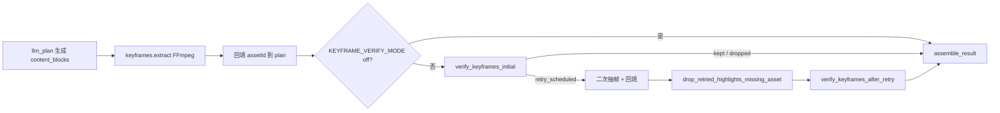

# 会话复盘：Keyframe Verify 两阶段优化与模块架构

> **会话背景**：在 Video Helper 分析流水线中，用户希望深入理解 `keyframe_verify` 机制（触发条件、LLM 调用方式、失败处理），并基于架构讨论落地两阶段 verify、per-highlight retry、LLM retry hint、有限并发等优化；实现后经 code review 修复线程安全、budget 冲突、指标语义等问题。
> **文档用途**：Keyframe Verify 模块的设计与实现参考；团队排障、benchmark 解读、后续扩展时的约束说明。

**关联文档**：[`docs/evaluation.md`](../evaluation.md)（L3 指标与阈值）、[`AGENTS.md`](../../AGENTS.md) §5.1（流水线阶段）、[`2026-06-29-video-helper-benchmark-eval-system-session.md`](2026-06-29-video-helper-benchmark-eval-system-session.md)（L3 评估体系总览）。

---

## 1. 问题总览（按严重程度）

| # | 现象 | 根因类别 | 最终状态 |
|---|------|----------|----------|
| 1 | 重抽后不再 verify，低质量帧可能进入 Result | 编排缺失二次校验 | 已修复（两阶段 verify） |
| 2 | 第一个 highlight 用掉全局 `retry_max` 后，后续 highlight 无法 retry | Job 级 retry 计数 | 已修复（per-highlight） |
| 3 | 并发 LLM 调用共享 `httpx.Client` | 线程安全 | 已修复（thread-local provider） |
| 4 | initial 用满 `MAX_PER_JOB` 后 retry verify 被静默跳过 | Job budget 与 retry 阶段共用上限 | 已修复（retry 阶段豁免 job cap） |
| 5 | `keepRate` 不含 `retried_kept`，benchmark 阈值易误判 | 指标定义 | 已优化（`overallKeepRate`） |
| 6 | OCR/图片过大等 prepare 失败时静默跳过 | 缺失败分支 | 已修复（`skipped_prepare` + drop） |
| 7 | 重抽后无 `assetId` 仍可能残留 keyframe 引用 | worker 缺校验 | 已修复（`drop_retried_highlights_missing_asset`） |
| 8 | 无 `highlightId` 的 highlight 无法进入二次 verify | 设计约束（刻意保留） | 已知限制 |

---

## 2. 模块在流水线中的位置

Keyframe Verify 是 **Plan 抽帧之后、assemble_result 之前** 的可选质量门，不改变对外 API 契约。



**编排入口**：[`services/core/src/core/app/worker/worker_loop.py`](../../services/core/src/core/app/worker/worker_loop.py)（约 L989–L1106）。

**核心实现**：[`services/core/src/core/app/pipeline/keyframe_verify.py`](../../services/core/src/core/app/pipeline/keyframe_verify.py)。

**对外阶段名**：内部 stage `keyframe_verify` 映射到公共阶段 `extract_keyframes`（[`contracts/stages.py`](../../services/core/src/core/contracts/stages.py)）。

---

## 3. 架构设计

### 3.1 两阶段门控模型

| 阶段 | 入口函数 | 候选范围 | 行为 |
|------|----------|----------|------|
| **initial** | `verify_keyframes_initial()` | `keyframeConfidence < 阈值` 且已有 `assetId` | keep → 保留；fail + 有 retry 预算 → 调度重抽；否则 drop |
| **retry** | `verify_keyframes_after_retry()` | `highlightId ∈ scheduled_highlight_ids` 且已有 `assetId` | keep → `retried_kept`；否则 → `retried_dropped`（不再第三次重抽） |

统一执行内核：`_run_verify_pass(phase=...)`，收集候选 → prepare → 并行 LLM → 串行写 plan 与 artifact。

### 3.2 触发条件（谁会被 verify）

仅 **Plan 自评低置信度** 的 highlight 进入 initial verify：

- Plan 开启 verify 时，LLM 输出 `highlight.keyframeConfidence`（0~1），见 [`llm_plan.py`](../../services/core/src/core/app/pipeline/llm_plan.py) 中 `_keyframe_verify_enabled()` 与 prompt schema。
- `keyframeConfidence >= KEYFRAME_VERIFY_CONFIDENCE_THRESHOLD`（默认 0.4）→ **跳过** verify。
- `keyframeConfidence` 缺失 → **跳过** verify（不视为低置信度）。
- 每个 highlight 只验证 `keyframes[0]`（第一张）。

**设计意图**：Plan 自评 + Verify 复核，避免对全部关键帧全量 LLM 校验。

### 3.3 LLM 调用模型

| 维度 | 设计 |
|------|------|
| 批量 | **不做**多图 batch；每个 highlight 一次 `generate_json("keyframe_verify", ...)` |
| 并发 | `ThreadPoolExecutor`，`KEYFRAME_VERIFY_CONCURRENCY`（默认 2，上限 8） |
| 线程安全 | 每 worker 线程 **独立** `llm_provider_for_jobs()`（thread-local），避免共享 `httpx.Client` |
| Session | SQLAlchemy `Session` **非线程安全**：并行前在主线程完成 asset 路径解析、OCR、base64 编码 |
| 模式 | `ocr`：Tesseract → 文本 LLM；`multimodal`：base64 图 + 多模态 LLM |
| 重试 | `_call_llm_with_backoff` 对 rate_limit / timeout 指数退避 |

### 3.4 LLM 输出契约

```json
{
  "keep": true,
  "confidence": 0.85,
  "reason": "画面含代码演示",
  "retry": {
    "direction": "before|after",
    "offsetMs": 3000
  }
}
```

- `retry` 仅在 `keep=false` 时可选。
- 服务端 `compute_retry_time_ms()` 对 `offsetMs` 与 highlight 时间窗 clamp；非法或缺失时 **fallback** 到中点方向启发式（`_compute_retry_time_ms_fallback`）。

### 3.5 预算与计数

| 环境变量 | 默认 | 含义 |
|----------|------|------|
| `KEYFRAME_VERIFY_MODE` | `off` | `off` / `ocr` / `multimodal` |
| `KEYFRAME_VERIFY_CONFIDENCE_THRESHOLD` | `0.4` | Plan 自评低于此值才 verify |
| `KEYFRAME_VERIFY_MAX_PER_JOB` | `5` | **initial 阶段** LLM 调用上限 |
| `KEYFRAME_VERIFY_MAX_PER_HIGHLIGHT` | `1` | **开关**：1=启用 initial verify，0=关闭 |
| `KEYFRAME_RETRY_MAX_PER_HIGHLIGHT` | `1` | 每个 highlight 最多调度 1 次重抽（`KEYFRAME_RETRY_MAX` 为别名） |
| `KEYFRAME_LOCAL_SEARCH_WINDOW_MS` | `10000` | retry 时间偏移上限 |
| `KEYFRAME_VERIFY_CONCURRENCY` | `2` | 并行 LLM worker 数 |
| `KEYFRAME_VERIFY_MAX_ATTEMPTS` | `2` | 单次 LLM 上游失败重试 |
| `KEYFRAME_VERIFY_IMAGE_MAX_BYTES` | `400000` | 超过则 multimodal prepare 失败 |

**重要**：retry 阶段 **不受** `MAX_PER_JOB` 限制，保证已调度重抽的 highlight 一定能进入二次 verify。

最坏 LLM 次数近似：`min(低置信度数, MAX_PER_JOB) + 实际 retry 数`（通常 ≤ `2 × MAX_PER_JOB`）。

### 3.6 results.jsonl 与 action 语义

路径：`DATA_DIR/{projectId}/artifacts/{jobId}/keyframe_verify/results.jsonl`

| action | phase | 含义 |
|--------|-------|------|
| `kept` | initial | 首次通过 |
| `retry_scheduled` | initial | 首次失败，已写入新 `timeMs` 等待重抽 |
| `dropped` | initial | 首次失败且无 retry 预算，或 `new_tm == tm` |
| `skipped_prepare` | initial | OCR/图片不可用，直接 drop |
| `retried_kept` | retry | 重抽后二次通过 |
| `retried_dropped` | retry | 二次失败、缺 asset、prepare 失败等 |

每条记录含 `phase`、`highlightId`、`timeMs`、`confidence`、`reason` 等；retry 相关含 `retryTimeMs`、`retryDirection`、`retryOffsetMs`。

---

## 4. 案例一：从单阶段到两阶段 verify

### 现象（优化前）

1. verify 失败后用规则器在 highlight 时间窗内偏移重抽，**重抽后不再 verify**，坏帧可能进入 Result。
2. `KEYFRAME_RETRY_MAX` 为 **Job 级全局计数**，第一个 highlight 消耗后其余无法 retry。
3. 逐张串行 LLM，无 retry hint，重抽方向仅靠中点启发式。

### 根因

- 编排为 `verify → extract → assemble`，缺 retry pass。
- retry 预算与 verify 预算混在同一可变 `budget.retry_max` 上递减。
- 未区分 initial / retry 阶段的状态机。

### 解决方案

1. 拆分 `verify_keyframes_initial` / `verify_keyframes_after_retry`。
2. worker：`initial → extract → backfill → drop_retried_highlights_missing_asset → after_retry → assemble`。
3. per-highlight retry 计数（`highlight_retry_used` 字典，键为 `highlightId` 或 fallback key）。
4. LLM retry hint + `compute_retry_time_ms` clamp/fallback。
5. 有限并发 + thread-local provider。

### 关键文件

- `services/core/src/core/app/pipeline/keyframe_verify.py`
- `services/core/src/core/app/worker/worker_loop.py`
- `services/core/tests/test_keyframe_verify.py`

### 可复述要点

> 关键帧 verify 不是「抽帧后全量 LLM 看图」，而是 Plan 标低置信度才复核。失败后先在同一 highlight 内换时间点重抽，**必须**再 verify 一次；二次仍失败则清空 keyframes、保留 highlight 文本。并发只并行 HTTP，DB 与 plan 变更仍在主线程串行完成。

---

## 5. 案例二：Code Review 后的加固

### 5.1 httpx 线程安全

**问题**：多线程共享同一 `AnalyzeProvider._client`。

**修复**：`_run_llm_outcomes_parallel` 内 `threading.local()` 缓存每线程 provider。

### 5.2 Job budget 与 retry 冲突

**问题**：initial 用满 `MAX_PER_JOB=5` 后，retry 阶段 `_collect_candidates` 因 `verify_used_job` 已满而收集 0 候选。

**修复**：`phase == "retry"` 时 `enforce_job_cap = False`。

### 5.3 指标 `keepRate` 误导

**问题**：两阶段下最终保留 = `kept + retried_kept`，原 `keepRate` 只计 initial。

**修复**：`keyframe_verify_metrics.py` 新增 `overallKeepRate`；`keepRateMin` 阈值优先看 `overallKeepRate`；新增 `secondVerifyPassRateMin` 等。

### 5.4 prepare 失败与缺 asset

**问题**：OCR 缺失、图片过大、重抽后无 `assetId` 时静默跳过。

**修复**：
- `_apply_skipped_prepare` → `action: skipped_prepare` 或 `retried_dropped`
- `drop_retried_highlights_missing_asset()` 在 worker 二次 verify 前调用

### 5.5 刻意保留：`highlightId` 制约

无 `highlightId` 的 highlight **不会**进入 `scheduled_highlight_ids`，重抽后也不会二次 verify。这是 **产品/契约约束**，本会话未做 fallback（用户明确要求保留）。

External 模式提交 plan 时必须保证 `highlightId` 稳定存在。

---

## 6. 技术决策记录

| 决策 | 备选 | 选择 | 理由 |
|------|------|------|------|
| LLM 调用粒度 | 多图 batch / 逐张 | **逐张** | 质量、错误隔离、当前 MAX_PER_JOB 规模下 batch 收益小 |
| 并发方式 | 共享 client + 锁 / thread-local provider | **thread-local provider** | 保留并发吞吐且避免 httpx 竞态 |
| retry 方向 | 纯规则 / 纯 LLM 时间戳 / hybrid | **LLM direction+offset + 服务端 clamp + 规则 fallback** | 语义合理且可测 |
| 二次 verify budget | 与 initial 共享 cap / 独立 cap / retry 豁免 | **retry 豁免 job cap** | 保证「重抽必再审」承诺 |
| 失败无图 | 保留 highlight 无 keyframe / Job 失败 | **drop keyframes，保留 highlight 文本** | 降级不阻断整 Job |
| 无 highlightId | fallback 内部 key / 要求 highlightId | **要求 highlightId** | 与 plan 契约一致，避免 retry 匹配歧义 |
| 前端/API | 暴露 verify 字段 | **不暴露** | 纯内部 pipeline 阶段 |

---

## 7. 内部数据流（单 pass）

```text
_collect_candidates(phase)
    ↓
_prepare_candidate_messages()     ← 主线程：Asset 路径、OCR/base64
    ↓ (失败 → _apply_skipped_prepare)
_run_llm_outcomes_parallel()      ← 线程池：thread-local provider → generate_json
    ↓
串行 apply outcomes:
  initial + keep     → action: kept
  initial + !keep    → compute_retry_time_ms → retry_scheduled | dropped
  retry + keep       → retried_kept
  retry + !keep      → retried_dropped + 清空 keyframes
    ↓
append_keyframe_verify_result()   → results.jsonl
```

---

## 8. Benchmark 集成（L3）

聚合：[`keyframe_verify_metrics.py`](../../services/core/src/core/app/benchmark/keyframe_verify_metrics.py)

| 指标 | 计算 |
|------|------|
| `keepRate` | initial `kept / count` |
| `overallKeepRate` | `(kept + retried_kept) / count` |
| `retryScheduledRate` | `retry_scheduled / count`（兼容旧 action `retried`） |
| `secondVerifyPassRate` | `retried_kept / (retried_kept + retried_dropped)` |
| `dropAfterRetryRate` | `retried_dropped / count` |
| `skippedPrepareRate` | `skipped_prepare / count` |

阈值 wiring：[`run_benchmark.py`](../../services/core/scripts/run_benchmark.py) 支持 `keepRateMin`（看 overall）、`overallKeepRateMin`、`secondVerifyPassRateMin`。

默认 `KEYFRAME_VERIFY_MODE=off` 时 benchmark **仍可完整运行**（`enabled: false`）。

---

## 9. 配置与运维备忘

| 变量 / 操作 | 建议 | 说明 |
|-------------|------|------|
| 本地启用 | `KEYFRAME_VERIFY_MODE=multimodal` | 需 LLM 凭证（DB 或 `.env`） |
| 成本控制 | `MAX_PER_JOB=5` | 限制 initial；retry 仍按调度数执行 |
| OCR 模式 | 系统 PATH 需 `tesseract` | 缺失时 prepare 失败 → drop |
| 排障 artifact | 读 `results.jsonl` | 按 `highlightId` + `action` 追踪决策链 |
| External plan | 必须有 `highlightId` | 否则无二次 verify |

**排障检查清单**：

1. `KEYFRAME_VERIFY_MODE` 是否为 `off`？
2. highlight 是否有 `keyframeConfidence < 0.4` 且 `keyframes[0].assetId`？
3. initial 是否 `retry_scheduled` 但 retry 无 `retried_*`？→ 查 budget、highlightId、asset 回填。
4. `skipped_prepare` 是否因 Tesseract 缺失或图片超 `IMAGE_MAX_BYTES`？
5. benchmark `keepRate` 低但 `overallKeepRate` 正常？→ 看两阶段指标，勿只看 initial keepRate。

---

## 10. 测试与验证

```bash
cd services/core
uv run pytest tests/test_keyframe_verify.py tests/test_benchmark_l3.py -q
```

**单测覆盖要点**（`test_keyframe_verify.py`）：

- `compute_retry_time_ms`：LLM hint / clamp / fallback
- initial keep / retry_scheduled / dropped
- per-highlight 独立 retry
- after_retry kept / dropped
- prepare 失败 drop
- initial budget 用尽后 retry verify 仍执行
- 编排序列：initial → backfill → drop missing → after_retry

**手工验证**（可选）：

1. `.env` 设置 `KEYFRAME_VERIFY_MODE=multimodal`
2. 跑一条含低 `keyframeConfidence` 的 Job
3. 检查 `DATA_DIR/.../keyframe_verify/results.jsonl` 含 `phase` 与 `retried_kept|retried_dropped`

---

## 11. 常见问题（Q&A）

### Q1：为什么不做多图 batch LLM？

**A**：默认每 Job 仅少量低置信度帧；batch 省 RTT 但增加 token 打包、失败隔离和 schema 复杂度，质量风险大于收益。

### Q2：重抽后为什么必须再 verify？

**A**：首次失败说明原时间点帧质量不足；换时间点不保证更好，二次 verify 是质量闭环的最后闸门。

### Q3：`keepRate` 和 `overallKeepRate` 看哪个？

**A**：评估**最终**关键帧保留用 `overallKeepRate`；分析首次 LLM 判断质量用 `keepRate`。

### Q4：verify 失败会让 Job 失败吗？

**A**：一般否——drop keyframes 后 highlight 文本仍进入 Result。仅 LLM 凭证缺失等 `AnalyzeError` 会使 Job 失败。

### Q5：磁盘上被 drop 的 asset 会删除吗？

**A**：不会；仅从 plan 移除引用，artifact 文件可能仍在 `DATA_DIR`。

---

## 12. 本会话关联改动

| Commit | 说明 |
|--------|------|
| `bcc6e3c` | feat(core-pipeline): 两阶段 verify、retry hint、并发、审查修复、单测 |
| `bbdef8b` | feat(core-benchmark): overallKeepRate 等指标与报告 |
| `e6ba24b` | docs: evaluation / AGENTS / .env.example |
| `61cfd2b` | chore(dev): make core-dev（与会话主议题无关） |

---

## 13. 遗留风险与后续改进

1. **同一 `timeMs` 多 highlight 重抽**：worker 按时间回填 asset，可能共用同一帧——极端情况下需按 highlight 维度抽帧去重。
2. **`MAX_PER_HIGHLIGHT` 命名**：当前仅为开关，若未来需要「每 highlight 多次 initial verify」需重命名或扩展语义。
3. **Worker 级 E2E 测试**：现有单测 + 编排序列测试；完整 worker_loop 集成测试仍可选补充。
4. **External 模式**：依赖 `highlightId`；需在 external plan 契约文档中强调。

---

*文档版本：2026-07-01 · 对应会话：Keyframe Verify 两阶段优化 · 模块架构与实现*
